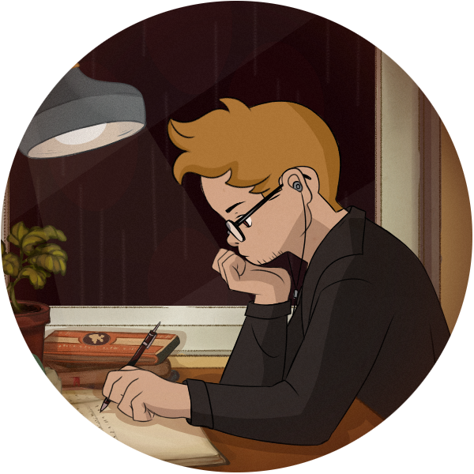

### Hi there, I'm Luis Thiago 

Computer Science student at <a href="http://www.uepb.edu.br/">Universidade Estadual da Paraíba - UEPB</a>

 

**Language and Tools**

</img>
</img>
</img>
</img>
</img>
</img>
</img>

**A little more about me...**

I'm a computer science student who is passionate about linux, open source and I also study cybersecurity in my spare time.

📈 My GitHub Stats

 

